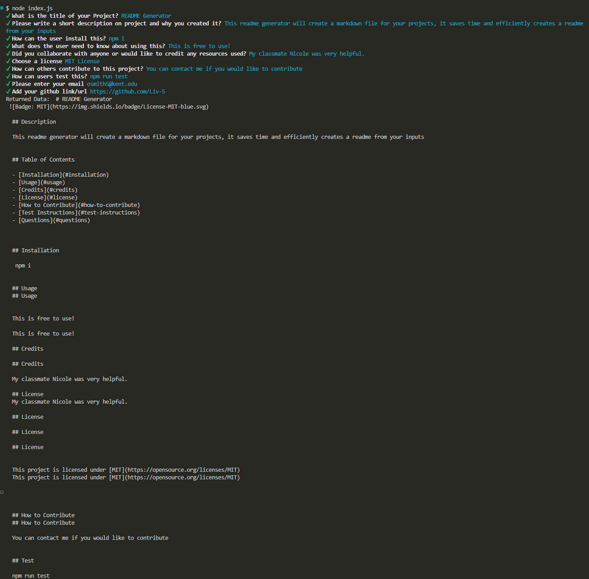
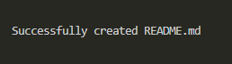
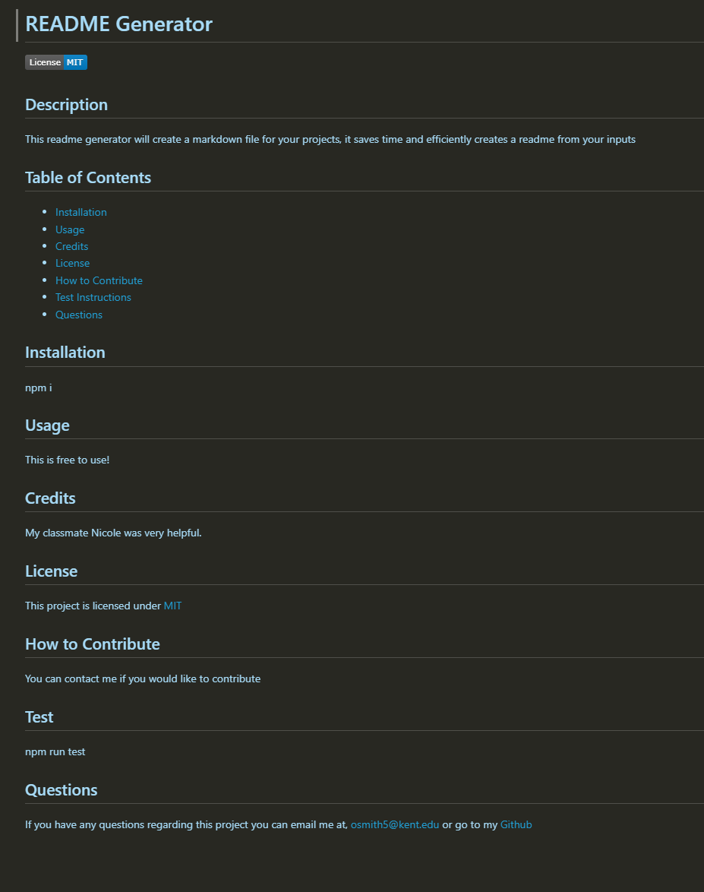

# README-Generator

## Description

Create a README.md file with ease and expedite your work by using this code to generate your README files.

## Github Repository

[GitHub Repository](https://github.com/Liv-5/README-Generator)

## Video walk-through

[README Generator video walk-through](https://drive.google.com/file/d/1QLt--9wImahmcNzHvdoQozo78uG-RXbb/view)

## Preview

